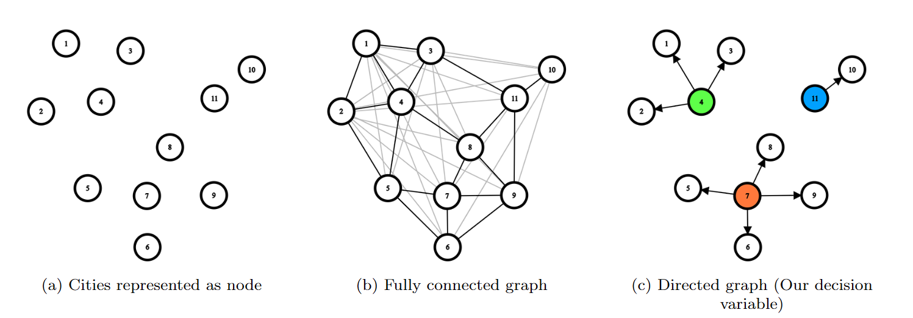

# warehouse-placement-ME312
Code for warehouse localization optimization using MILP and genetic algorithms

# Description
This repository contains the code for the warehouse localization optimization problem. The problem is to find the optimal location of warehouses in a given region such that the maximum distance between a warehouse and a city is minimized. The problem is solved using Mixed Integer Linear Programming (MILP) and genetic algorithms.

# Solver
The MILP problem is solved using the [Gurobi](https://www.gurobi.com/) solver. The genetic algorithm is implemented using the pymoo library.

# Problem Formulation
The problem is formulated to minimize the maximum distance between a warehouse and a city. The objective function is given by:


## Decision Variables
- $a_{i,j}$ is a binary variable that is 1 if city `i` is supplied by warehouse at city `j` and 0 otherwise.



## Objective Function
The objective function is given by:

minimize  $\tilde{d}$

where $\tilde{d} \geq d_{ij} * a_{i,j}$

where $d_{i,j}$ is the distance between city `i` and city `j`. 

## Constraints
### Iteration 1
- "Each city is supplied by exactly one warehouse"

    $\sum_{j=1}^{N} a_{i,j} = 1 \quad \forall i$ 

- "If city `j` is supplied by warehouse at city `j`, then city `i` is also supplied by the same warehouse"

    $a_{i,j} \leq a_{j,j} \quad \forall i,j$

- "Number of warehouses"

    $\sum_{i=1}^{N} a_{i,i} = W$


# How to run the code

1. Install the required packages using the following command:
```bash
pip install -r requirements.txt
```

2. Run the code using the following command:
- For the MILP iteration:
    ```bash
    # For the first two warehouse, N is the number of warehouses
    python warehouse_1.py -n N 
    # For the second iteration
    python warehouse_2.py -n N
    # For the third iteration, B is the budget
    python warehouse_3.py -b B
    # For the fourth iteration
    python warehouse_4.py -b B
    ```
- For the genetic algorithm:
    ```bash
    python warehouse_1_pymoo.py
    python warehouse_2_pymoo.py
    python warehouse_3_pymoo.py
    ```
# Plots
The plots are saved in the `plots` directory.
| Number of warehouses | MILP Iteration 1 | MILP Iteration 2
| --- | --- | --- |
| 1 |  | Infeasible
| 5 |  | Infeasible 
| 7 |  | 
| 9 |  | 

# Shapefiles
The map data and shapefiles were obtained from the [Hindustan Times Labs](
    https://github.com/HindustanTimesLabs/shapefiles/blob/master/state_ut/rajasthan/district/rajasthan_district.zip
)