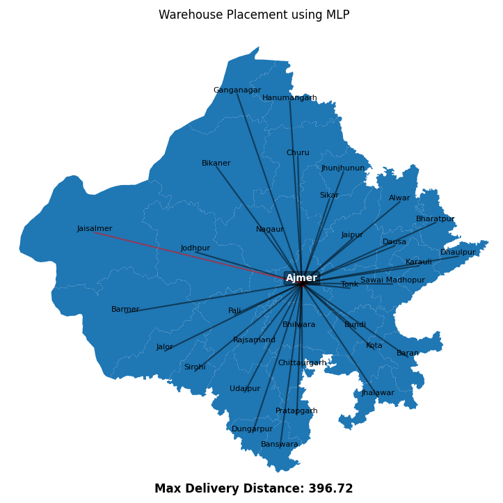
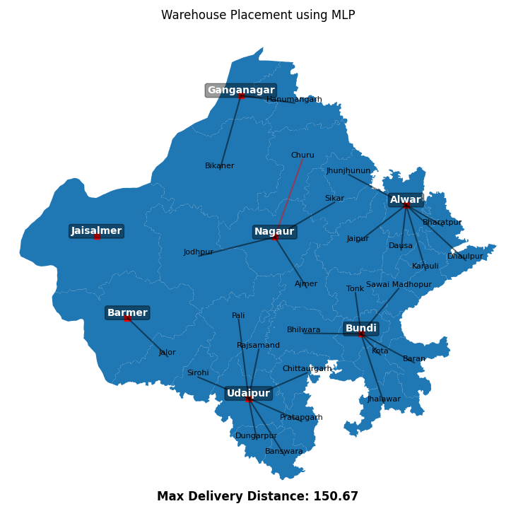
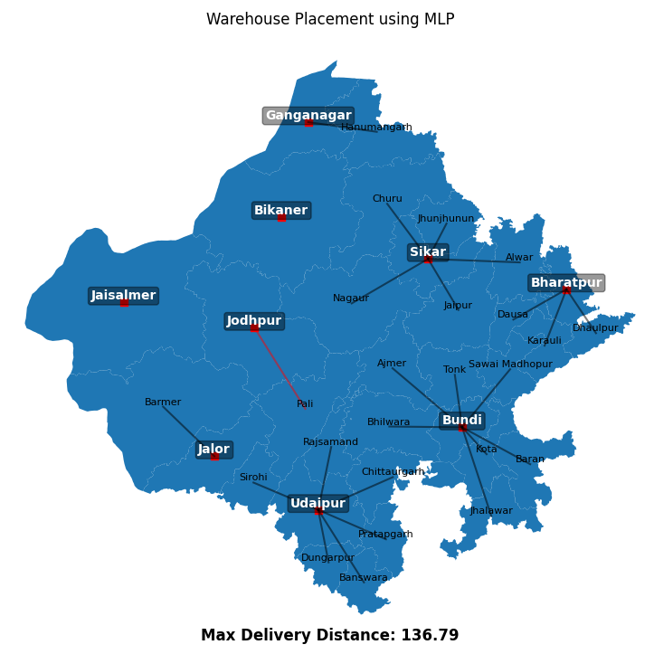
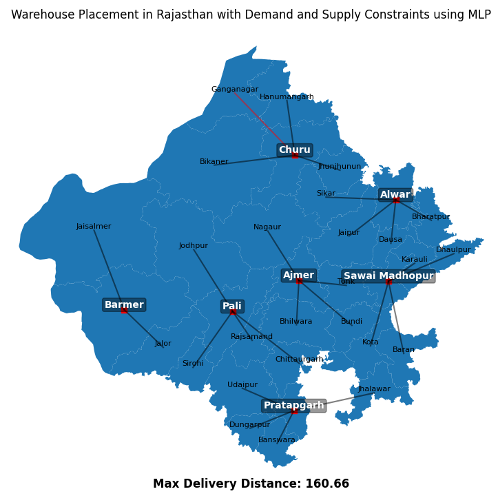
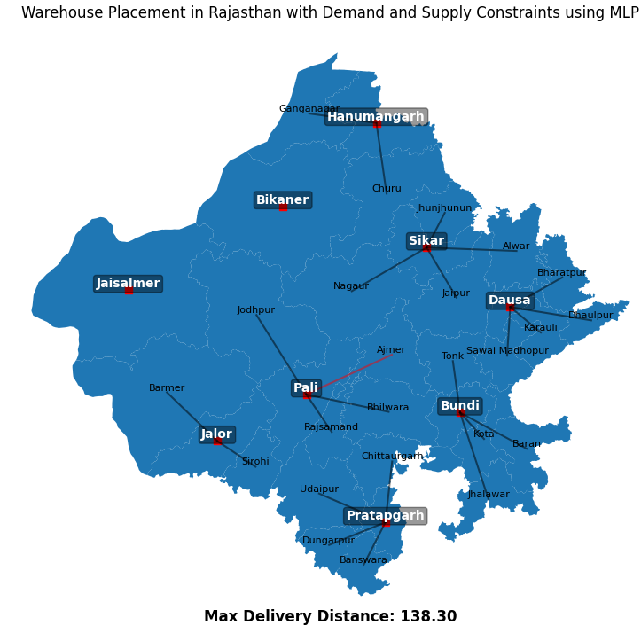

# warehouse-placement-ME312
Code for warehouse localization optimization using MILP and genetic algorithms


# How to run the code

1. Install the required packages using the following command:
```bash
pip install -r requirements.txt
```

2. Run the code using the following command:
- For the MILP iteration:
    ```bash
    # For the first two warehouse, N is the number of warehouses
    python warehouse_1.py -n N 
    # For the second iteration
    python warehouse_2.py -n N
    # For the third iteration, B is the number of buildings
    python warehouse_3.py -b B
    # For the fourth iteration
    python warehouse_4.py -b B
    ```
- For the genetic algorithm:
    ```bash
    python warehouse_1_pymoo.py
    python warehouse_2_pymoo.py
    python warehouse_3_pymoo.py
    ```
# Plots
The plots are saved in the `plots` directory.
| Number of warehouses | MILP Iteration 1
| --- | --- |
| 1 |  
| 5 |   
| 7 |  
| 9 |  

| Number of warehouses | MILP Iteration 2
| --- | --- |
| 7 | 
| 9 | 